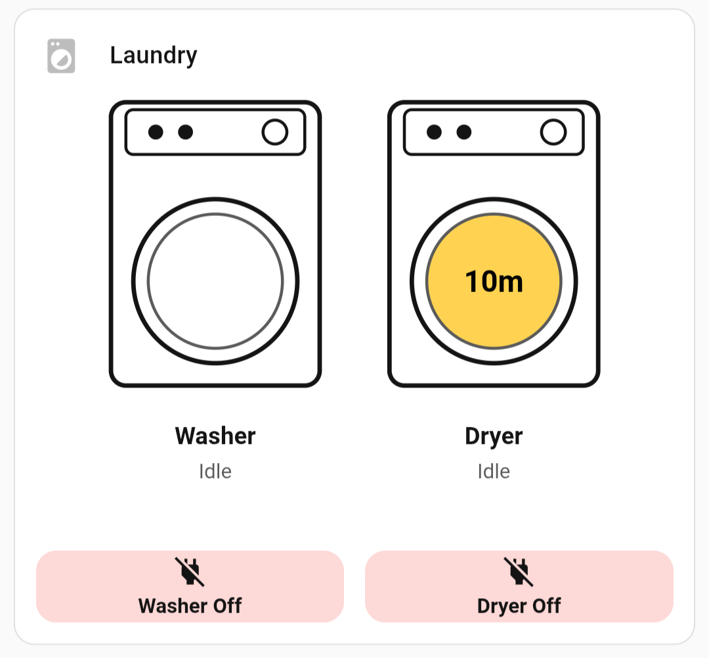

# Laundry Status Card

A custom Home Assistant Lovelace card that displays washer and dryer status with SVG visuals.



## Features

- SVG machine visuals with color-coded status (running/finished/idle)
- Time since finished display
- Real-time power consumption readout
- Optional door sensor indicators
- Fully configurable via visual editor
- Customizable colors, labels, and SVG sizing

## Requirements

This card requires:
- **Power sensor entities** for each machine (e.g., from a smart plug)
- **`input_select` helpers** with options: `idle`, `running`, `finished`
- **An automation** that manages the state transitions (see below)

### Helper Setup

Create two `input_select` helpers:
- `input_select.washer_status` — options: `idle`, `running`, `finished`
- `input_select.dryer_status` — options: `idle`, `running`, `finished`

### Automation

The automation monitors power consumption and sets the status:
- Power > threshold for 30s → set `running`
- Power < 5W for 5 min AND status is `running` → set `finished`
- Door opened → set `idle`

See [automation-example.yaml](automation-example.yaml) for a complete example.

## Installation

### HACS (recommended)
1. Add this repository as a custom repository in HACS
2. Install "Laundry Status Card"
3. Add the resource to your dashboard

### Manual
1. Download `laundry-status-card.js` from the latest release
2. Place in `/config/www/`
3. Add as a resource: `/local/laundry-status-card.js`

## Configuration

| Option | Type | Default | Description |
|--------|------|---------|-------------|
| `washer_power_entity` | string | **required** | Power sensor for washer |
| `dryer_power_entity` | string | **required** | Power sensor for dryer |
| `washer_status_entity` | string | **required** | input_select for washer status |
| `dryer_status_entity` | string | **required** | input_select for dryer status |
| `washer_door_entity` | string | optional | Binary sensor for washer door |
| `dryer_door_entity` | string | optional | Binary sensor for dryer door |
| `washer_label` | string | `Washer` | Display label for washer |
| `dryer_label` | string | `Dryer` | Display label for dryer |
| `color_running` | string | `#4CAF50` | Color when running |
| `color_finished` | string | `#FFC107` | Color when finished |
| `color_idle` | string | `var(--card-background-color)` | Color when idle |
| `show_power` | boolean | `true` | Show wattage when running |
| `show_time` | boolean | `true` | Show minutes since finished |
| `show_labels` | boolean | `true` | Show machine labels |
| `svg_width` | number | `130` | SVG width in pixels |
| `svg_height` | number | `180` | SVG height in pixels |
| `fill_opacity` | number | `0.7` | Door fill opacity |
| `text_color_on_fill` | string | `#000000` | Text color on colored fill |

## Example YAML

```yaml
type: custom:laundry-status-card
washer_power_entity: sensor.washingmachine1_power
dryer_power_entity: sensor.dryer1_power
washer_status_entity: input_select.washer_status
dryer_status_entity: input_select.dryer_status
washer_door_entity: binary_sensor.washingmachinedoor1_contact
dryer_door_entity: binary_sensor.dryerdoor1_contact
```

## License

MIT

## Support

If you find this card useful, consider buying me a coffee:

[](https://buymeacoffee.com/sebconn)
